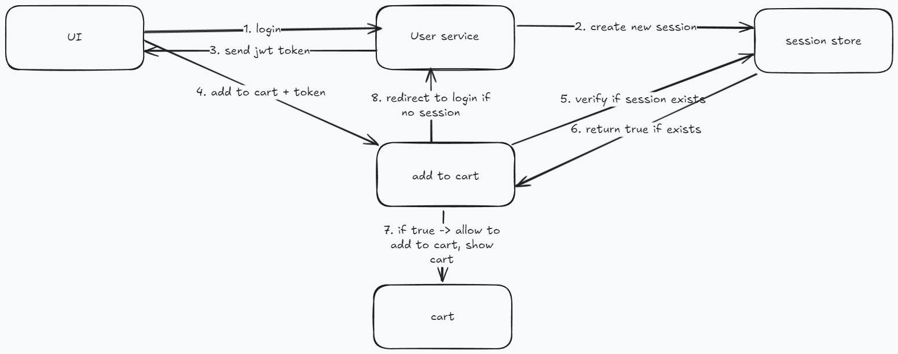
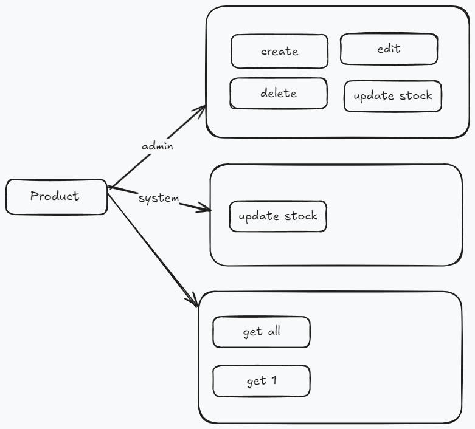
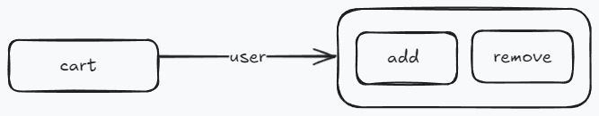
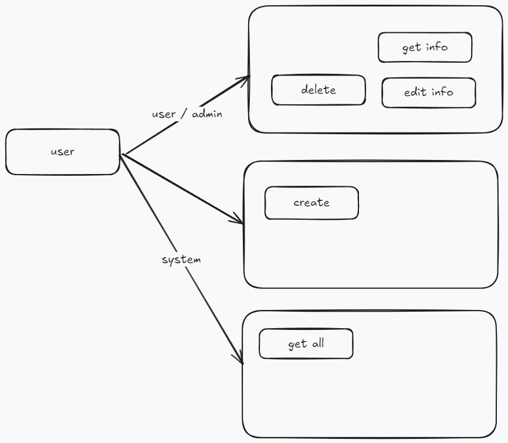
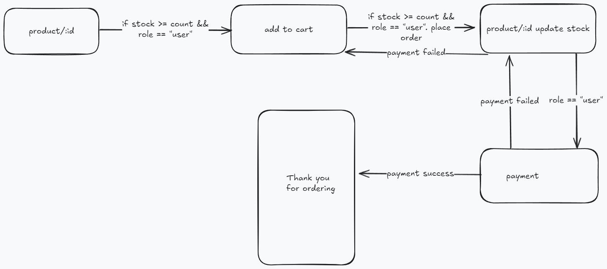

# Full stack E-commerce application

To build a full-fledged ecommerce application using microservices architecture.

## Services

- [ ] Frontend
- [x] [Main Service](/backend/main/)
- [x] [User Service](/backend/user-service/)
- [x] [Product Service](/backend/products-service/)
- [x] [Cart Service](/backend/cart-service/)
- [ ] Payment Service

## Setup

- Backend

```bash
cd backend
cp .env.local .env
# add the environment variables
pnpm install
pnpm run dev
```

- Prisma

```bash
npx prisma studio
```

## Technologies

- `expressjs` for the backend
- `microservices` architecture
- `redis` for session storage
- `gRPC` for communication between microservices
- `prisma` for ORM on `postgresql`

## Key Resources






